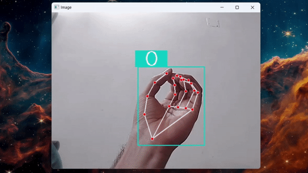

# Sign Language Detection Model with TensorFlow, Keras, OpenCV and Mediapipe 🖐️

## Computer Vision Sign Language Detection Model with TensorFlow, Keras, OpenCV and Mediapipe 

This Computer Vision Model, detects the letters of the Sign Language. It can recognizes the letters "A", "B", "L", "H" and "O".

The Model was trained with more than 1500 Images, 300 Images from each Sign Language Letter, and using Transfer Learning, from the CNN VGG-16 TensorFlow Model.

Mediapipe detects any Hand from the Image, then is cropped, and last the Model classifies which letter is of the Sign Language.

The code to collect any Sign Language Letter Image of the Hand is the `data_collection.ipynb` file and the code of the Model is in the `sign_language_model.ipynb` file.

## Check-it out
- Sign Language Detection ModelPreview: https://www.youtube.com/watch?v=pqRB8yQv9lk

